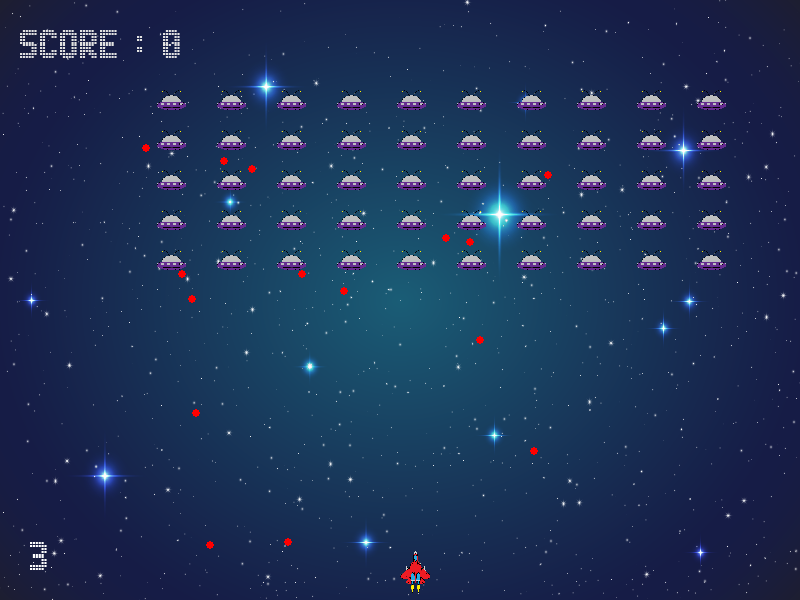

# Space Invaders Project

## Install
### Dependencies
- python3
- pygame
## Instructions
| Key(s) | Description |
|--------|-------------|
| **Space** | Fire |
|**Left** and **Right** button | Move |
|**Alt**+**Enter** | On title screen to toggle fullscreen. |
|**Esc** | Exit Game |

## Credits
### Programmers
- Anthony Hernandez
- Iteoluwakiisi George Olaniyan
- Mang Nung
- Marcus Ed. Butler
- Quang Nguyen

### Sprites
- [Sprites](Assets/Sprite_sheet.png) Created by: Iteoluwakiisi “George” Olaniyan

### Fonts
- [Advanced LED Board 7](https://www.1001fonts.com/advanced-led-board-7-font.html) Created by: Style-7
